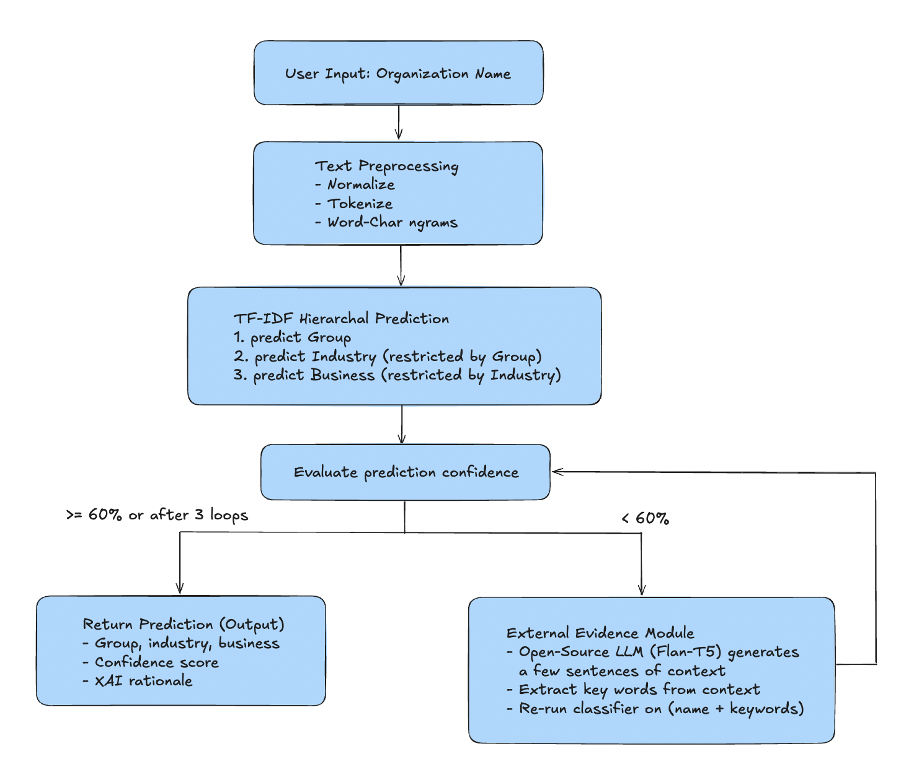

# Label Organization Categories with Natural Language Processing
Final Project for CSC 482: Natural Language Processing

Created by: [Bernice Lau](https://www.linkedin.com/in/lau-bernice/) and [Josh Frendberg](https://www.linkedin.com/in/joshua-frendberg-1ab46022a/)

## Description
Given a database of about 60,000 existing organizations with all categories determined, our program accepts the user-inputted name of an organization and uses NLP techniques to guess at the categories across the industry, group, and business levels corresponding to that organization. 

## Design Diagram
