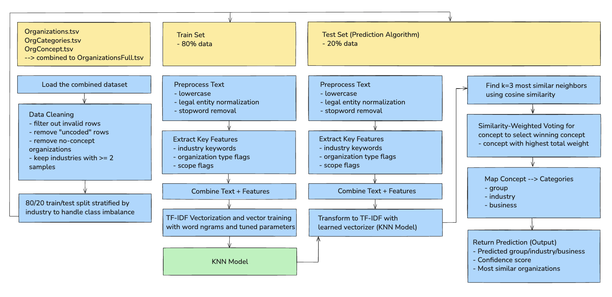
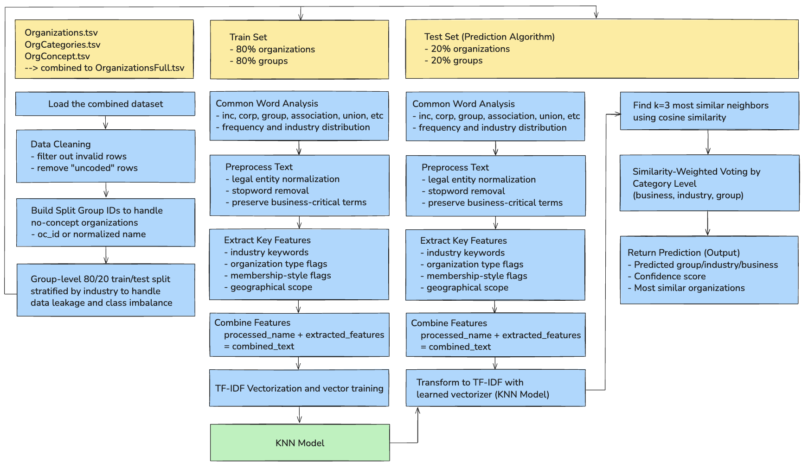

# Label Organization Categories with Natural Language Processing
Final Project for CSC 482: Natural Language Processing

Created by: [Bernice Lau](https://www.linkedin.com/in/lau-bernice/) and [Josh Frendberg](https://www.linkedin.com/in/joshua-frendberg-1ab46022a/)

## Description
Given a database of about 60,000 existing organizations with all categories determined, our program accepts the user-inputted name of an organization and uses NLP techniques to guess at the categories across the industry, group, and business levels corresponding to that organization.

## Quick Start

### Installation
```bash
pip install -r environment.txt
```

### Process Data
```bash
cd processing
python processing.py
cd ..
```

### Tune Hyperparameters
```bash
cd code/training
python hyperparameter_tuning.py
cd ..
```

### Train and Run the Model
```bash
cd code/training
python knn_model_v3.py
```

### Running the webapp
```bash
cd code 
uvicorn apps.api.app:app --reload
```
In another terminal:
```bash
cd code/apps/frontend
npm install
npm run dev
```

## KNN (v1) Model Design Diagram


## KNN (v3) Revised Model Design Diagram

